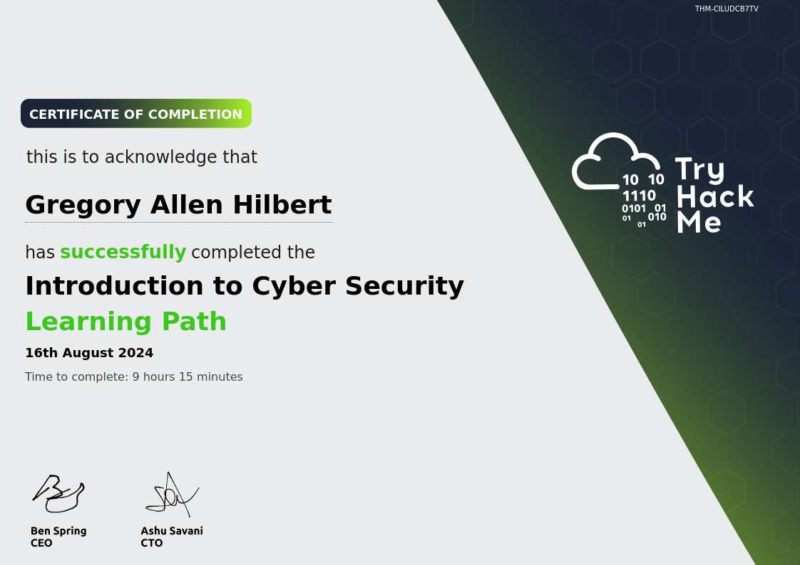

### [Main Portfolio Page](index.md) 

---
# Projects & Labs

Showcasing my hands on projects and labs I've worked through. I'm very proud of how far I've came, it's been genuinely fun! I hope you enjoy exploring my work. 

---

## Table of Contents
- [Projects](#projects)
  - [DHCP Server Configuration](dhcp-server-configuration)
  - [Cisco Network Configuration](#cisco-network-configuration)

- [Labs](#labs)
  - [TryHackMe](#tryhackme)

---

## Projects
### DHCP Server Configuration
[View Report](Project PDFs/DHCPconfigurationProject.pdf)
- Configured a DHCP server with 2 different networks attached, utilizing static and dynamic IP addressing.
- Created rules to avoid IP address conflicts, while maintaining routability across the networks.

### Cisco Network Configuration 
[View Detailed Overview](Project PDFs/NetworkConfigurationProject.pdf) <!-- Consider changing wording from diagram to report depending on what I'm showcasing -->
   - Configured a simple network using 4 PCs, 2 Cisco switches, and a Cisco router
   - Established connectivity between the devices by configuring the router's gigabit ethernet ports and manually assigning static IP addresses to the PCs 

---

## Labs

### TryHackMe
   - **Introduction to Cybersecurity Path**  

  - Offensive security: Successfully hacked web applications, taking advantage of common security issues
  - Defensive security: Used digital forensics to defend against live cyber attacks, where time was of the essence

--- 

## TryHackMe <a href="https://tryhackme.com/r/p/Gahilbe91" target="_blank">Public Profile</a>
[Main Portfolio Page](index.md)
